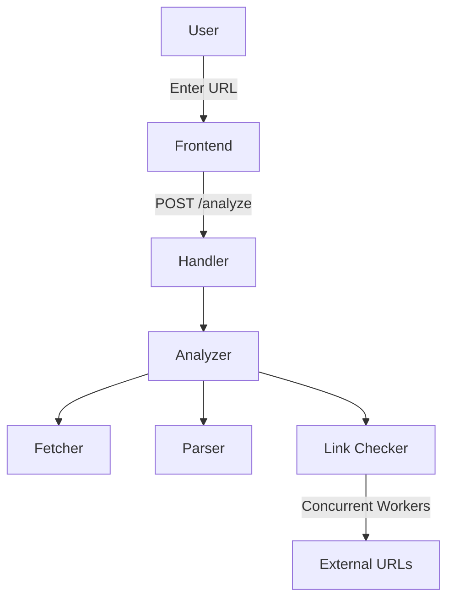
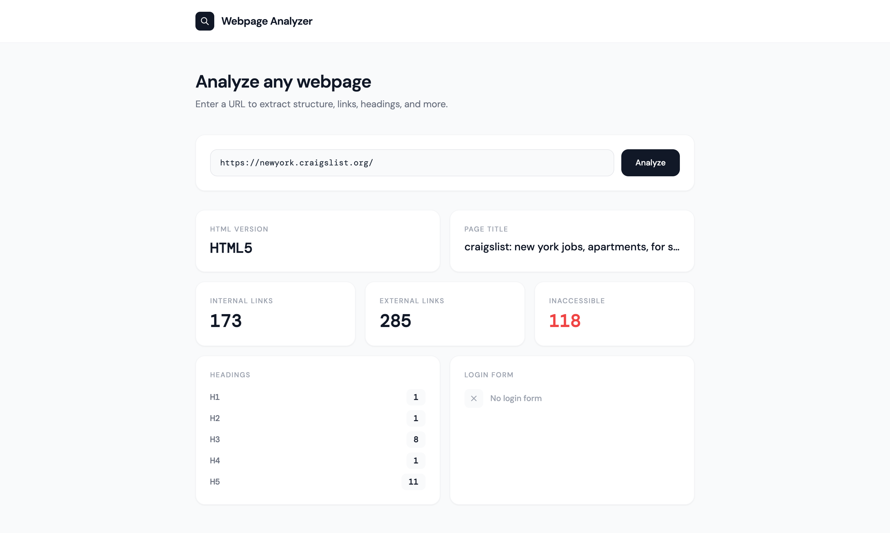
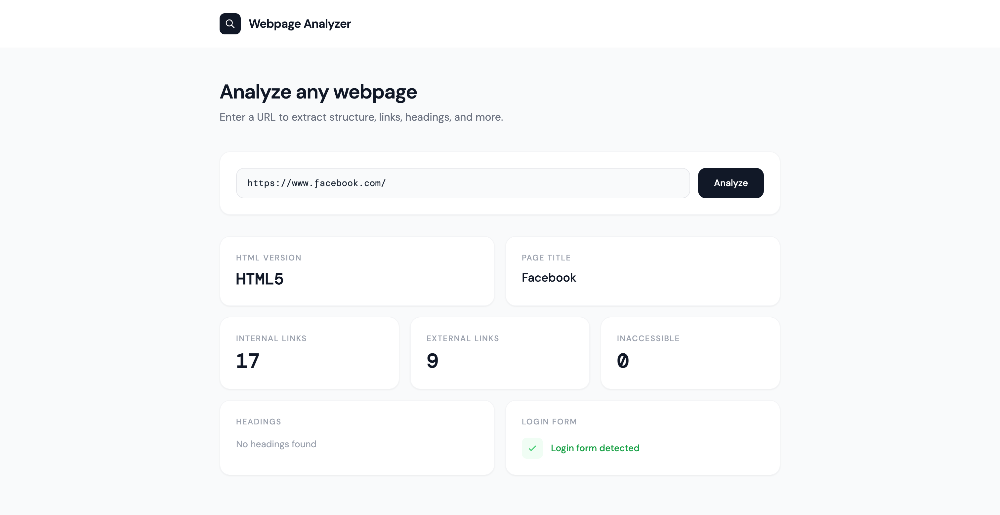
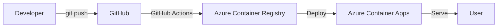

# Go Webpage Analyzer

A web application built in Go that analyzes the structure and content of any web page.

## Project Overview

Go Webpage Analyzer accepts a URL as input and returns a detailed analysis of the web page including HTML version, page title, heading structure, link analysis, and login form detection.


## Architecture


## Project Structure
 
```
go-webpage-analyzer/
├── cmd/server/          # Application entry point
├── internal/
│   ├── analyzer/        # Core analysis engine
│   │   ├── analyzer.go  # Orchestrates the full analysis
│   │   ├── fetcher.go   # Fetches raw HTML from a given URL
│   │   ├── parser.go    # Parses HTML and extracts data
│   │   └── links.go     # Concurrent link accessibility checker
│   └── handler/         # HTTP request handlers
├── web/
│   └── templates/       # HTML templates
```

### Component Responsibilities
 
- **Fetcher** — Takes a URL and returns the raw HTML response. Handles timeouts and unreachable URLs.
- **Parser** — Reads the HTML and extracts the title, HTML version, headings, links, and login form detection.
- **Link Checker** — Takes the raw list of links from the parser and concurrently checks each one.
- **Analyzer** — Orchestrates fetcher, parser, and link checker and returns the final result.
 
## API
 
| Method | Endpoint | Description |
|--------|----------|-------------|
| GET | / | Serves the analyzer form |
| POST | /analyze | Analyzes the given URL |


### Request
 
```json
POST /analyze
Content-Type: application/json
 
{
    "url": "https://example.com"
}
```
 
### Success Response
 
```json
{
    "html_version": "HTML5",
    "title": "Example Domain",
    "headings": {
        "h1": 1
    },
    "has_login_form": false,
    "internal_links": 0,
    "external_links": 1,
    "inaccessible_links": 0
}
```
 
### Error Response
 
```json
{
    "success": false,
    "error": "URL returned status 404: Not Found"
}
```

## Screenshots




## Technology Stack
 
### Backend
- Language: Go 1.26+
- HTTP Server: net/http 
- HTML Parsing: golang.org/x/net/html
- Logging: log/slog
- Profiling: net/http/pprof
 
### DevOps
- Docker + Docker Compose
- Makefile
- GitHub Actions (CI/CD)

## External Dependencies
 
| Package | Purpose |
|---------|---------|
| github.com/joho/godotenv | Environment variables |
| golang.org/x/net/html | HTML parsing |


## Installation & Setup
 
### 1. Clone the repository
```bash
git clone https://github.com/pavithrawp/go-webpage-analyzer.git
cd go-webpage-analyzer
```

### 2. Install dependencies
```bash
go mod download
```
 
### 3. Set up environment variables
```bash
cp .env.example .env
```

### 4. Running Tests
 
```bash
go test ./...
```
 
With coverage:
```bash
go test ./... -cover
```
 
### 5. Run the application
```bash
go run cmd/server/main.go
```

## Running With Docker
 
```bash
# Build and run with Docker Compose
docker-compose up --build
 
# Or manually
docker build -t go-webpage-analyzer .
docker run -p 8080:8080 --env-file .env go-webpage-analyzer
```


## Makefile Commands
 
```bash
make run            # Run the application
make build          # Build the binary
make test           # Run tests
make test-coverage  # Run tests with coverage
make lint           # Run golangci-lint
make check          # Run fmt, vet and lint
make docker-build   # Build Docker image
make docker-run     # Run Docker container
make clean          # Remove build artifacts
```

## Features
 
- **HTML Version Detection** — Identifies the HTML version from the DOCTYPE declaration
- **Page Title** — Extracts the full page title including HTML entities
- **Heading Analysis** — Counts headings by level (h1-h6)
- **Link Analysis** — Identifies and counts internal vs external links
- **Inaccessible Links** — Concurrently checks all links using a worker pool
- **Login Form Detection** — Detects presence of login forms by looking for password inputs
- **Error Handling** — Returns meaningful JSON error messages with HTTP status codes
- **Structured Logging** — Uses Go's slog for structured logging
- **Profiling** — pprof endpoints available at /debug/pprof/ (protected with basic auth)

## Assumptions & Decisions
 
- **Login form detection** uses the presence of `<input type="password">` inside a `<form>`. This covers the majority of login forms.
- **JavaScript-rendered pages** are not supported. 
- **HEAD requests** are used for link accessibility checks as they are faster and lighter than GET requests. Some servers block HEAD requests which may cause false positives for inaccessible links. This is a known limitation.
- **Subdomains are treated as external** links.
- **Anchor-only links** (e.g. `#section`) are excluded from link counts


## Challenges & Approaches
 
- **Concurrent link checking** — Firing one goroutine per link works but is dangerous for pages with hundreds of links. Solved with a bounded worker pool of 20 goroutines using channels and WaitGroups.
- **Relative URL resolution** — Links like `/about` needed to be resolved against the base URL before accessibility checks. Used `url.ResolveReference` from the standard library.
- **Non-HTML responses** — Without Content-Type validation the analyzer would try to parse PDFs and images as HTML. Added a Content-Type check in the fetcher to reject non-HTML responses early.
- **Memory efficiency** — Initially the HTML body was read into `[]byte` then converted to `string`, causing double allocation. Fixed by passing `resp.Body` as an `io.Reader` directly to `html.Parse`.


## Possible Improvements (TODOs)

- Add support for JavaScript-rendered pages using a headless browser
- Add caching layer
- Add rate limiting
- Add fallback from HEAD to GET for link accessibility checks since some servers block HEAD requests
- Add streaming HTML parsing to avoid loading the full page into memory for very large pages
- Export results as PDF or JSON

## Deployment Architecture


## Live Demo

The application is deployed and accessible at:
```
https://go-webpage-analyzer.blacksky-dcf644d4.southindia.azurecontainerapps.io/
```

> Note: The application is publicly accessible for evaluation purposes.
> In a production environment authentication would be added.

