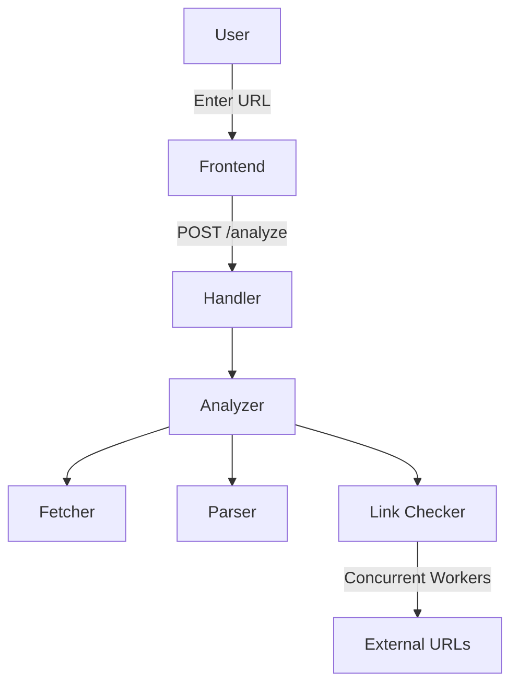

# Go Webpage Analyzer

A web application built in Go that analyzes the structure and content of any web page.

## Project Overview

Go Webpage Analyzer accepts a URL as input and returns a detailed analysis of the web page including HTML version, page title, heading structure, link analysis, and login form detection.

## Architecture


## Project Structure
 
```
go-webpage-analyzer/
├── cmd/server/          # Application entry point
├── internal/
│   ├── analyzer/        # Core analysis engine
│   │   ├── analyzer.go  # Orchestrates the full analysis
│   │   ├── fetcher.go   # Fetches raw HTML from a given URL
│   │   ├── parser.go    # Parses HTML and extracts data
│   │   └── links.go     # Concurrent link accessibility checker
│   └── handler/         # HTTP request handlers
│   └── validator/       # URL validation
```

### Component Responsibilities
 
- **Fetcher** — Takes a URL and returns the raw HTML response. Handles timeouts and unreachable URLs.
- **Parser** — Reads the HTML and extracts the title, HTML version, headings, links, and login form detection.
- **Link Checker** — Takes the raw list of links from the parser and concurrently checks each one.
- **Analyzer** — Orchestrates fetcher, parser, and link checker and returns the final result.
 

## Prerequisites

- Go 1.26 or higher
- Docker
- Git

## External Dependencies
 
| Package | Purpose |
|---------|---------|
| github.com/joho/godotenv | Environment variables |


## Installation & Setup
 
### 1. Clone the repository
```bash
git clone https://github.com/pavithrawp/go-webpage-analyzer.git
cd go-webpage-analyzer
```

### 2. Install dependencies
```bash
go mod download
```
 
### 3. Set up environment variables
```bash
cp .env.example .env
```
 
### 4. Run the application
```bash
go run cmd/server/main.go
```

## API
 
| Method | Endpoint | Description |
|--------|----------|-------------|
| GET | / | |
| POST | /analyze | Analyzes the given URL |


## Possible Improvements (TODOs)

- Add support for JavaScript-rendered pages using a headless browser
- Add caching layer
- Add rate limiting